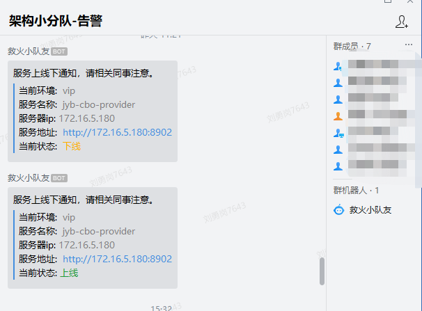

# 微服务集群监控 
你还在为公司没有监控程序而发愁吗？你还在为客户投诉而烦恼吗？如果有上述烦恼，请关注本项目，本项目是一个轻量级的springboot项目监控系统


# 这个项目学会以后能干啥？
  学习本项目后，可以解决上述烦恼，“生产服务上线-下线” 会向相关人员发送通知，及时处理生产问题 <br/>
  通知方式：
  - 企业微信群机器人（已实现）
  - 钉钉机器人（未实现）
  - 短信通知（未实现）
  - 邮件通知（未实现）
  - 自动给相关人员拨打电话（未实现）
> 其他通知方式实现起来也很简单，暂时没有那么多时间去实现，后期会继续完善

#相信现在很多企业的web应用场景：
- Nginx + 多个Tomcat  或者 Apache + 多个Tomcat
- 微服务场景下后端服务（spring-cloud、dubbo、spring-cloud-alibaba、docker、k8s）约来越多,小的团队维护 10+ 服务,大的团队可能维护 成百上千 服务

## 现在遇到的问题是服务约来越多,如何对服务进行监控呢？

 <br/><br/>
 <br/>
> 这些监控软件都是重量级的,学习成本比较高，那有没有简单的方式呢？答案肯定是有的,使用zk就可以轻松实现<br/>

 <br/><br/>
# 本项目的监控实现原理是使用zk的临时节点实现


操作zk的方式有很多，哪种比较简单呢？首选Apache 维护的curator 客户端工具api


使用本项目也非常简单
- 第一步：只需要引入依赖包，引入此依赖包后，项目启动以后，就会通过zk客户端工具自动把本项目注册到zk的临时节点上
> zk的服务器地址维护暂时比较喽,写死在代码中，后期可以根据不同环境变量设置到application.properties中，也可以从注册中心读取，暂时只想简单实现，解决现在的问题，后期慢慢优化
> 文件地址：com.jyb.monitor.client.ClientConfig.getZk()
```
 <dependency>
    <groupId>com.jyb</groupId>
    <artifactId>jyb-monitor-client</artifactId>
    <version>1.0.12-SNAPSHOT</version>
 </dependency>
```


- 第二步：启动服务端监控项目去监听zk注册的服务变化，如果变化，会通过企业微信群机器人通知相关人员
> 服务端zk更改-文件地址：com.jyb.monitor.server.config.ZkConfig.getZk
```
 运行 jyb-monitor-server 项目下的 serverStart
```


